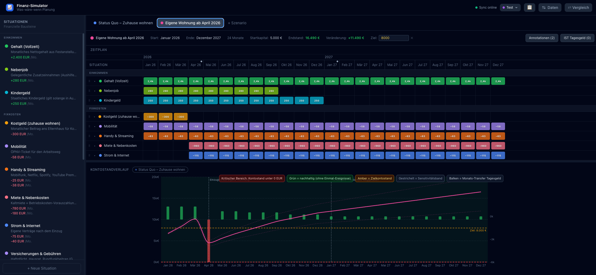

# Finanz-Szenario-Simulator

A web-based **"what-if" financial planning tool** — not accounting software, not a spreadsheet. Model different life situations, place them on a timeline, and watch how alternative futures play out in your account balance over months and years.

> Built to think in *scenarios*, not in rows.

---

## Screenshot



---

## Features

### Core Planning
- **Financial Situations** — reusable building blocks with recurring income/expenses and one-time events
- **Visual Timeline Editor** — paint months like a Gantt chart; drag rows to reorder
- **Effect-level Toggles** — disable individual income/expense effects per month within a situation
- **Scenario Management** — create, duplicate, edit, and delete independent futures
- **Live Balance Chart** — updates instantly as you paint the timeline
- **Overlay Mode** — compare multiple scenario lines directly in the editor chart
- **Full Comparison View** — all scenarios overlaid in one chart with a summary table

### Analysis
- **Sustainable Phase Indicator** — green areas mark months where recurring cash flow ≥ 0 (ignoring one-time events)
- **Goal Balance Line** — optional amber reference line to visualize a savings target
- **Month Annotations** — attach notes to specific months; visible as markers in the chart and timeline header
- **Sensitivity Band** — set a ±% variance per effect to render pessimistic/optimistic balance bands

### Data & Collaboration
- **Multi-User Profiles** — isolated data namespaces per user, no account needed
- **Real-time Sync** — optional SSE-based sync server for shared access on a local network
- **PDF Export** — balance chart + summary table as a downloadable PDF
- **JSON Import / Export** — full data backup and restore
- **Audit Log** — 7-day change history with automatic retention

---

## Tech Stack

| Layer | Technology |
|-------|-----------|
| Frontend | React 18 + TypeScript (strict) |
| Build | Vite |
| State | Zustand (localStorage persistence) |
| Charts | Recharts |
| Styling | Tailwind CSS v3 (dark theme) |
| Container | Docker + nginx (multi-stage) |
| Sync Service | Node.js (SSE + REST) |

No central account required. The lightweight sync service shares scenario data across active clients via Server-Sent Events.

---

## Getting Started

### Configuration

Copy `.env.example` to `.env` and adjust the ports if the defaults conflict with other services:

```bash
cp .env.example .env
```

| Variable | Default | Description |
|----------|---------|-------------|
| `DEV_PORT` | `5173` | Vite dev server port (`npm run dev`) |
| `HOST_PORT` | `3000` | Docker host port (`docker compose up`) |

### Local Development

```bash
npm install
npm run dev
```

Open [http://localhost:5173](http://localhost:5173) (or your custom `DEV_PORT`). The app loads with sample data so you can explore immediately. No sync server required for local development.

### Docker (Full Stack)

```bash
docker compose up --build
```

Open [http://localhost:3000](http://localhost:3000) (or your custom `HOST_PORT`). Includes the sync service for real-time multi-client collaboration.

### Production Build

```bash
npm run build   # outputs to dist/
```

---

## How It Works

### 1 — Define Situations

A **Situation** is a reusable financial building block with one or more effects:

- *Vollzeitjob* → recurring income of +2,400 €/month
- *Miete* → recurring expense of −780 €/month
- *Umzug* → one-time expense of −6,690 € (deposit + movers + furniture)
- Any combination of recurring and one-time effects in a single situation

Each effect can have an optional **variance** (±%) to model uncertainty — e.g. ±25% on leisure spending generates a pessimistic/optimistic band in the chart.

### 2 — Build Scenarios

A **Scenario** is a possible future: a starting balance, a time range, and a set of situations placed on a timeline.

Paint months in the timeline grid to activate a situation for that period. Situations can start and end at different months within the same scenario — this is how you model transitions like moving out of home or changing jobs.

### 3 — Analyze

- The **balance chart** shows how your account evolves month by month
- **Green areas** mark phases where recurring income covers recurring expenses
- **Dashed bands** show the optimistic/pessimistic range if variances are set
- **Annotations** mark key events (e.g. "Move-in day") directly on the chart

### 4 — Compare

Use the **overlay toggles** above the chart to render other scenarios' lines alongside the active one — or switch to full **Comparison Mode** for a side-by-side overview of all scenarios.

---

## Simulation Model

- Time resolution: **monthly** (`YYYY-MM` strings, no date library)
- **Recurring effects**: applied every month the scenario entry is active
- **One-time effects**: applied only in the entry's first active month
- **Sensitivity**: each effect can define a variance percentage and direction (`+`, `−`, `±`) — the engine computes pessimistic and optimistic balance tracks in a single pass
- Scenarios are computed **independently** as pure functions — no shared state between them
- Balance at month end = previous balance + Σ(income) − Σ(expenses)

---

## Project Structure

```
src/
├── types.ts              # All TypeScript interfaces
├── simulation.ts         # Pure simulation engine (simulateScenario)
├── store.ts              # Zustand store + localStorage persistence
├── realtime.ts           # SSE sync hook (useRealtimeSync)
├── utils/
│   ├── months.ts         # YYYY-MM string utilities (no date-fns)
│   ├── profiles.ts       # Multi-user profile management
│   └── auditLog.ts       # 7-day audit log
└── components/
    ├── SituationsSidebar.tsx
    ├── SituationForm.tsx
    ├── ScenarioTabs.tsx
    ├── ScenarioSettings.tsx  # Goal balance, annotations
    ├── TimelineEditor.tsx    # Gantt-style paint grid
    ├── BalanceChart.tsx      # Single/overlay scenario chart
    └── ComparisonChart.tsx   # Full multi-scenario chart

sync-server/
└── server.js             # Node.js: GET/PUT /api/state, SSE /api/events
```

---

## License

[MIT](LICENSE)
